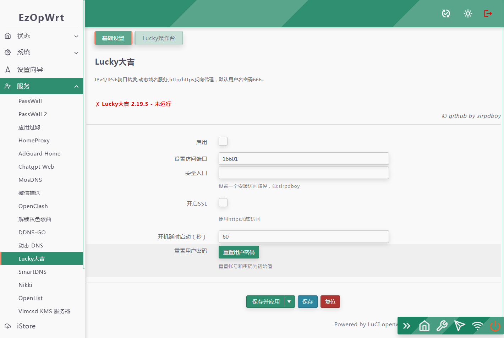
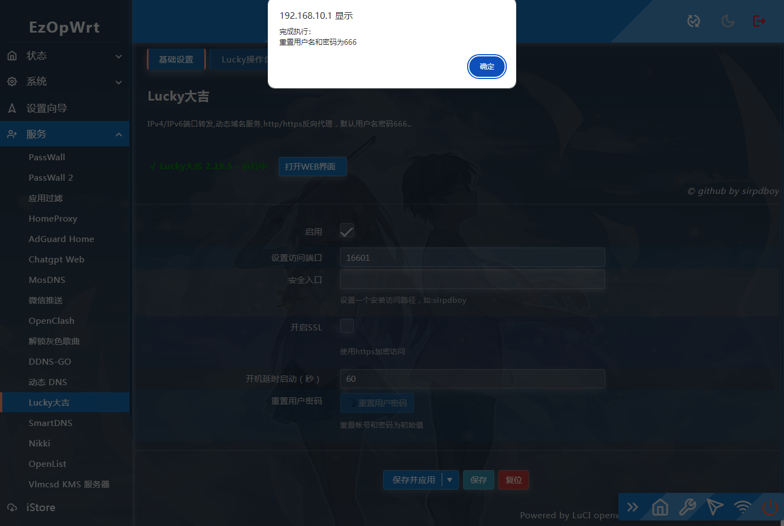
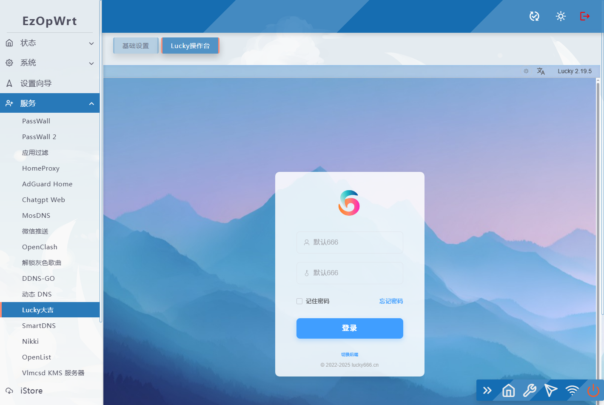

## 访问数：[](https://t.me/joinchat/AAAAAEpRF88NfOK5vBXGBQ)
### 访问数：[] [](https://t.me/joinchat/AAAAAEpRF88NfOK5vBXGBQ)


<p align="center">
<a href="https://openwrt.org"></a>
<a href="https://www.google.com/chrome/"></a>
<a href="https://www.apple.com/safari/"></a>
<a href="https://www.mozilla.org/firefox/"></a>
<a target="_blank" href="https://github.com/sirpdboy/luci-app-lucky/releases"> </a>
<a href="https://github.com/sirpdboy/luci-app-lucky/releases"></a>
</p>


欢迎来到sirpdboy的源码仓库！
=
# Lucky

本项目是 ([Lucky](https://github.com/gdy666/lucky)) 在 OpenWrt 上的移植。

luci-app-lucky 动态域名ddns-go服务,替代socat主要用于公网IPv6 tcp/udp转内网ipv4,http/https反向代理

[](#解决-github-网页上图片显示失败的问题) [](https://t.me/joinchat/AAAAAEpRF88NfOK5vBXGBQ)

[luci-app-lucky Lucky](https://github.com/sirpdboy/luci-app-lucky)
======================


请 **认真阅读完毕** 本页面，本页面包含注意事项和如何使用。

## 功能说明：

### Lucky

#### 动态域名ddns-go服务,替代socat主要用于公网IPv6 tcp/udp转内网ipv4,http/https反向代理

#### 在LUCI中可以配置访问端口和增加是否允许外网访问设置。

<!-- TOC -->

- [lucky](#lucky)
  - [使用方法](#使用方法)
  - [说明](#说明)
  - [问题](#常见问题)
  - [界面](#界面)
  - [捐助](#捐助)
 

<!-- /TOC -->

## 使用方法

- 将luci-app-lucky添加至 LEDE/OpenWRT 源码的方法。

### 下载源码方法:

 ```Brach
 
    # 下载源码
	
    git clone https://github.com/sirpdboy/luci-app-lucky.git package/lucky
    make menuconfig
	
 ``` 
### 配置菜单

 ```Brach
    make menuconfig
	# 找到 LuCI -> Applications, 选择 luci-app-lucky, 保存后退出。
 ``` 
 
### 编译

 ```Brach 
    # 编译固件
    make package/lucky/luci-app-lucky/compile V=s
 ```

## 说明

- 源码来源：https://github.com/gdy666/lucky

- 源码来源：https://github.com/sirpdboy/luci-app-lucky


- 你可以随意使用其中的源码，但请注明出处。

## 常见问题

 - 不同于防火墙端口转发规则,不要设置没有用上的端口,会增加内存的使用.
 - 小米路由 ipv4 类型的80和443端口被占用,但只设置监听tcp6(ipv6)的80/443端口转发规则完全没问题.
 - 如果需要使用白名单模式,请根据自身需求打开外网访问后台管理页面开关.
 - 转发规则启用异常,端口转发没有生效时请登录后台查看日志.
 - 开启外网访问可以直接修改配置文件中的"AllowInternetaccess": false, 将false改为true


## 界面







# My other project

- 路由安全看门狗 ：https://github.com/sirpdboy/luci-app-watchdog
- 网络速度测试 ：https://github.com/sirpdboy/luci-app-netspeedtest
- 计划任务插件（原定时设置） : https://github.com/sirpdboy/luci-app-taskplan
- 关机功能插件 : https://github.com/sirpdboy/luci-app-poweroffdevice
- opentopd主题 : https://github.com/sirpdboy/luci-theme-opentopd
- kucat酷猫主题: https://github.com/sirpdboy/luci-theme-kucat
- kucat酷猫主题设置工具: https://github.com/sirpdboy/luci-app-kucat-config
- NFT版上网时间控制插件: https://github.com/sirpdboy/luci-app-timecontrol
- 家长控制: https://github.com/sirpdboy/luci-theme-parentcontrol
- 定时限速: https://github.com/sirpdboy/luci-app-eqosplus
- 系统高级设置 : https://github.com/sirpdboy/luci-app-advanced
- ddns-go动态域名: https://github.com/sirpdboy/luci-app-ddns-go
- 进阶设置（系统高级设置+主题设置kucat/agron/opentopd）: https://github.com/sirpdboy/luci-app-advancedplus
- 网络设置向导: https://github.com/sirpdboy/luci-app-netwizard
- 一键分区扩容: https://github.com/sirpdboy/luci-app-partexp
- lukcy大吉: https://github.com/sirpdboy/luci-app-lukcy

## 捐助


|       |    | 
| :-----------------: | :-------------: |
| |  |

<a href="#readme">
    
</a>
