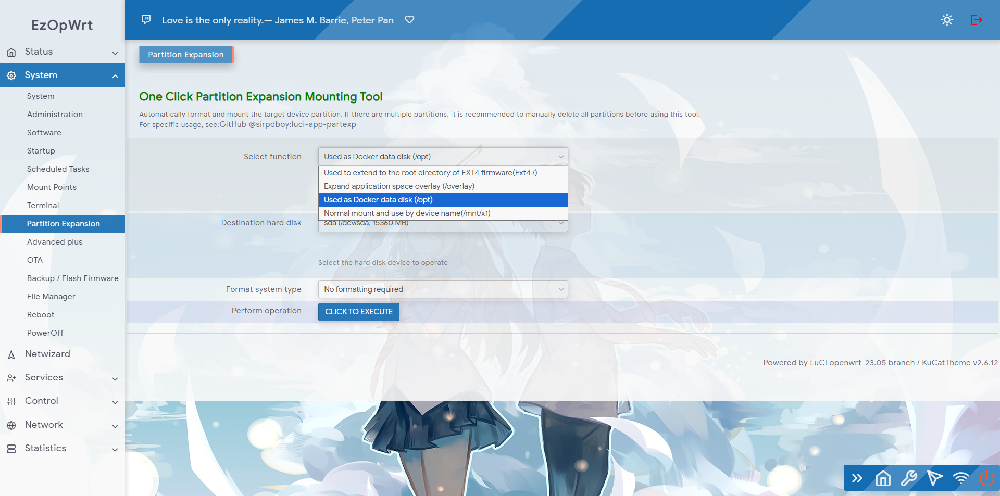
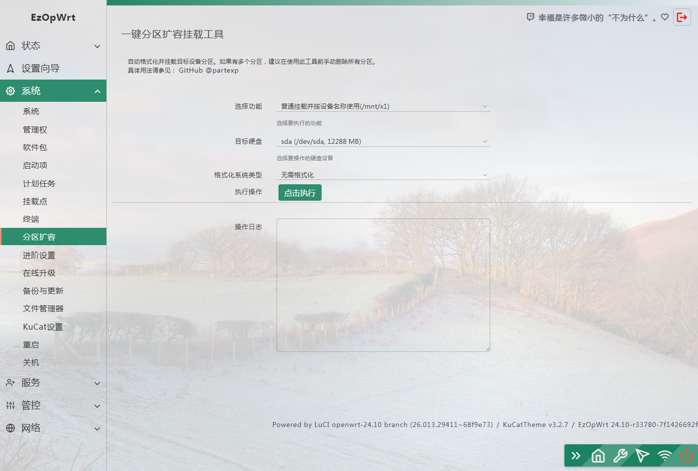
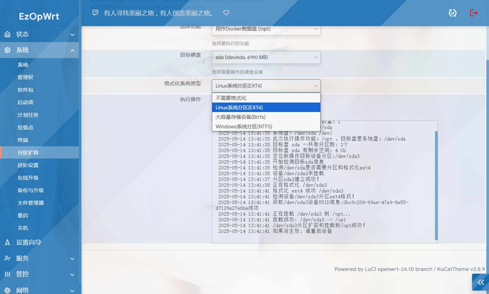

 [](https://t.me/joinchat/AAAAAEpRF88NfOK5vBXGBQ)

<h1 align="center">
  <br>luci-app-partexp<br>
</h1>

  <p align="center">

  <a target="_blank" href="https://github.com/sirpdboy/luci-app-partexp/releases">
    
  </a>
</p>

[中文] | [English](README.md) 


Please read this page carefully, which includes precautions and instructions on how to use it.


#### One click automatic formatting of partitions, expansion, and automatic mounting of plugins, designed specifically for OPENWRT to simplify the tedious operation of partition mounting for OPENWRT. This plugin requires a lot of effort from Sirpdboy to create and test. Please do not delete the creator's information!!

## Version

- Latest update version number: V1.3.1
- Update Date: March 26, 2025
- Update content:
- Reorganize the partition expansion code and address some unreasonable areas.
- Add the format for the target partition, which can be specified as ext4, ntfs, Btrfs, or no format.
- When used as a root directory/or/overlay, it will be formatted in ext4 format.
- At present, the testing on X86 machines is completely normal, and it has not been tested on other routing devices. Please submit the hard disk partition status and error message if there are any issues.

 
 
## Characteristics
Luci app parexp automatically obtains formatted partition expansion and automatically mounts plugins


### Method for downloading source code:

 ```Brach
    # downloading
    git clone https://github.com/sirpdboy/luci-app-partexp.git package/luci-app-partexp
    make menuconfig
	
 ``` 
### Configuration Menu
 ```Brach
    make menuconfig
	# find LuCI -> Applications, select luci-app-partexp, save and exit
 ``` 
### compile

 ```Brach 
    # compile
    make package/luci-app-partexp/compile V=s
 ```


## describe

- luci-app-partexp：https://github.com/sirpdboy/luci-app-partexp


## interface








# My other project

- Watch Dog ： https://github.com/sirpdboy/luci-app-watchdog
- Net Speedtest ： https://github.com/sirpdboy/luci-app-netspeedtest
- Task Plan : https://github.com/sirpdboy/luci-app-taskplan
- Power Off Device : https://github.com/sirpdboy/luci-app-poweroffdevice
- OpentoPD Theme : https://github.com/sirpdboy/luci-theme-opentopd
- Ku Cat Theme : https://github.com/sirpdboy/luci-theme-kucat
- Ku Cat Theme Config : https://github.com/sirpdboy/luci-app-kucat-config
- NFT Time Control : https://github.com/sirpdboy/luci-app-timecontrol
- Parent Control: https://github.com/sirpdboy/luci-theme-parentcontrol
- Eqos Plus: https://github.com/sirpdboy/luci-app-eqosplus
- Advanced : https://github.com/sirpdboy/luci-app-advanced
- ddns-go : https://github.com/sirpdboy/luci-app-ddns-go
- Advanced Plus）: https://github.com/sirpdboy/luci-app-advancedplus
- Net Wizard: https://github.com/sirpdboy/luci-app-netwizard
- Part Exp: https://github.com/sirpdboy/luci-app-partexp
- Lukcy: https://github.com/sirpdboy/luci-app-lukcy

## HELP

|       |    | 
| :-----------------: | :-------------: |
| |  |

<a href="#readme">
    
</a>

 [](https://t.me/joinchat/AAAAAEpRF88NfOK5vBXGBQ)
