<div align="center">
  <h1 align="center">
    LuCI design theme for OpenWrt
  </h1>
<a href="/LICENSE">
    
  </a>
  <a href="https://github.com/gngpp/luci-theme-design/pulls">
    
  </a><a href="https://github.com/gngpp/luci-theme-design/issues/new">
    
  </a><a href="https://github.com/gngpp/luci-theme-design/releases">
    
  </a><a href="hhttps://github.com/gngpp/luci-theme-design/releases">
    
  </a>
</div>
<br>

<br>English | [简体中文](README.md)

# luci-theme-design

### luci-theme-design is an OpenWrt LuCI theme for immersive WebApp experience and optimization on mobile and PC
- **luci-theme-design** based on luci-theme-neobird, for [lede](https://github.com/coolsnowwolf/lede) / [OpenWrt](https://github.com/openwrt/ openwrt)
- The default branch only supports the lua version of the lede source code. If you use openwrt 21/22, please pull the [js](https://github.com/gngpp/luci-theme-design/tree/js) version (development stage).

- You can define some settings using [plugin](https://github.com/gngpp/luci-app-design-config)
   - Support changing theme dark/light mode
   - Support show/hide navigation bar
   - Support replacing commonly used proxy icons

### If you find it useful, please click a star, your support is the driving force for my long-term updates, thank you.
  
- Thanks for non-commercial open source development authorization by [JetBrains](https://www.jetbrains.com/)!
<a href="https://www.jetbrains.com/?from=gnet" target="_blank"></a>

### Release version

- Lua version select 5.x version
- JS version select 6.x version

### Features

- Adapt to the responsive optimization of the mobile terminal, suitable for use as a WebApp on the mobile terminal
- Modified and optimized the display of many plug-ins, improved icon icons, and unified visuals as much as possible
- Simple login interface, bottom navigation bar, immersive app-like experience
- Adapt to dark mode, adapt to system automatic switching, support custom mode
- Adapt to openwrt 21/22, lede

### Experience WebApp method

- Open the settings management in the mobile browser (iOS/iPadOS, Android Google) and add it to the home screen.
- If the SSL certificate is not used, iOS/iPadOS will display the menu bar at the top of the browser after opening a new page for security reasons.

### Optimization

- Optimize menu collapsing and zooming
- Optimized to display network port down state display icon
- Support QWRT (QSDK), iStore wizard navigation
- Adapt to OpenWrt 21/22
- Adapt to linkease series icons

### Compile

```
git clone https://github.com/gngpp/luci-theme-design.git package/luci-theme-design
make menuconfig # choose LUCI->Theme->Luci-theme-design
make V=s
```

### Q&A

- The resource interface icon is not perfect. If you have the ability to draw a picture, you are welcome to pr, but please make sure it is consistent with the existing icon color style
- If there is a bug, please raise an issue
- The theme's personal color matching may not meet the public's appetite, welcome to provide color matching suggestions

### Preview

<details> <summary>iOS</summary>
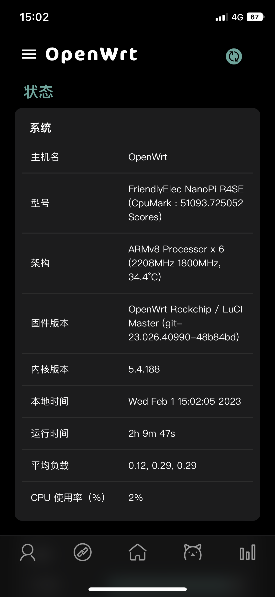
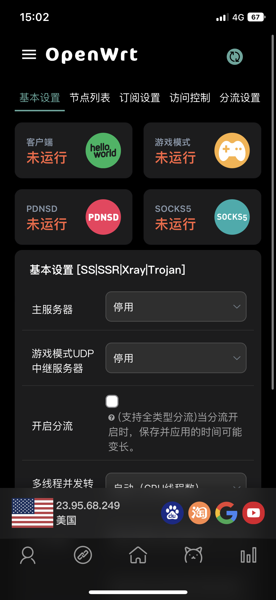
</details>

<details> <summary>iPadOS</summary>
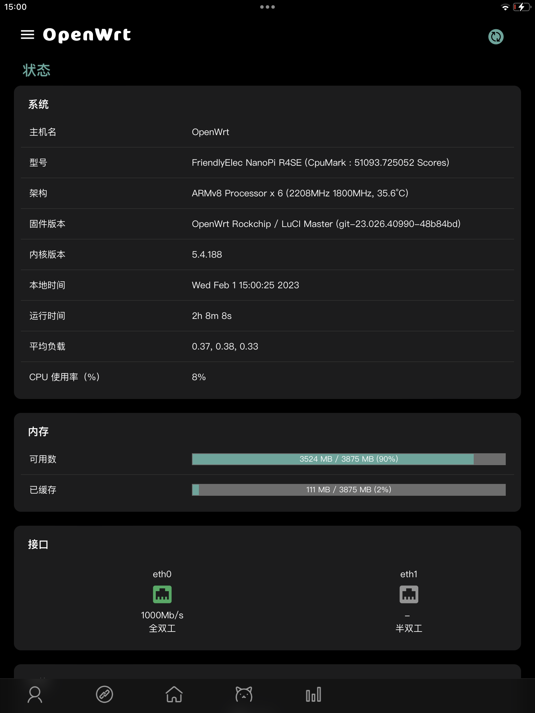
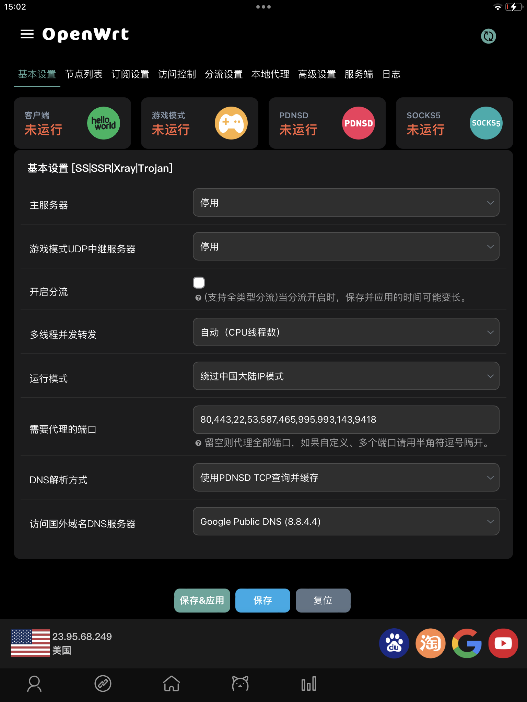
</details>

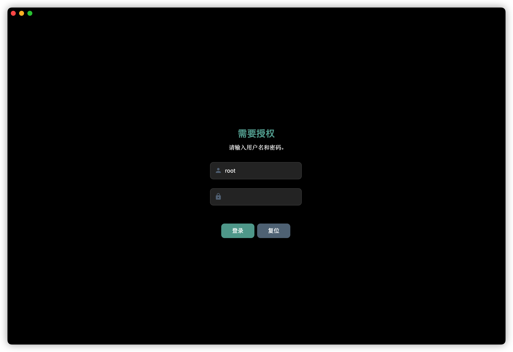
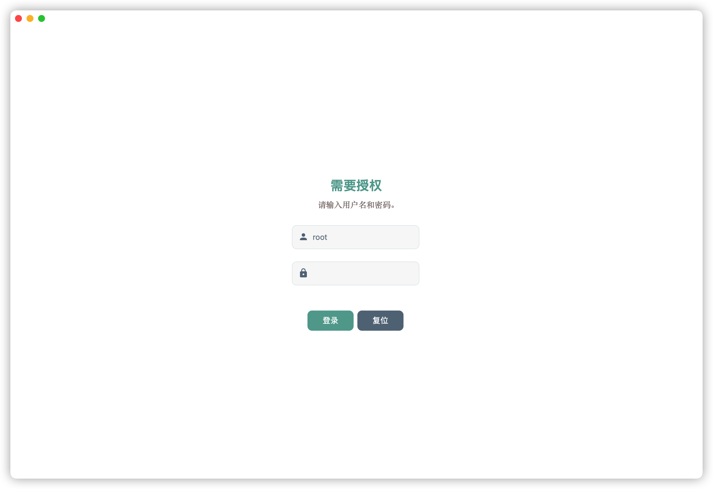
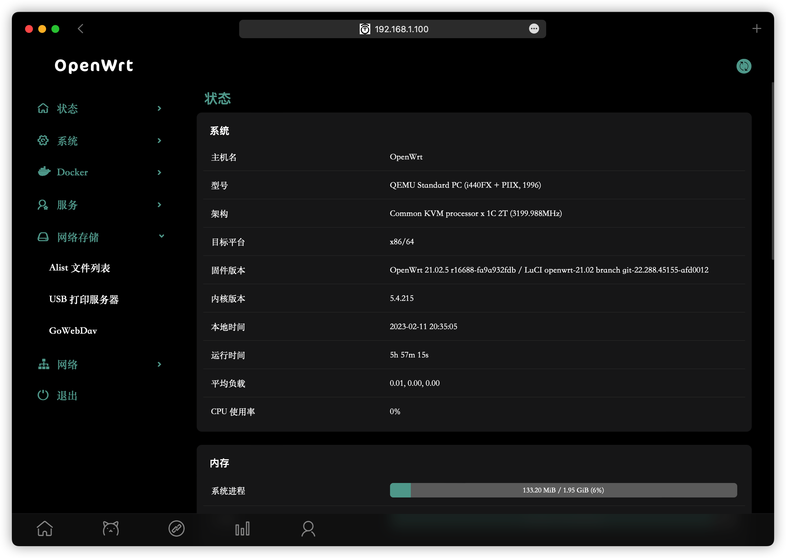
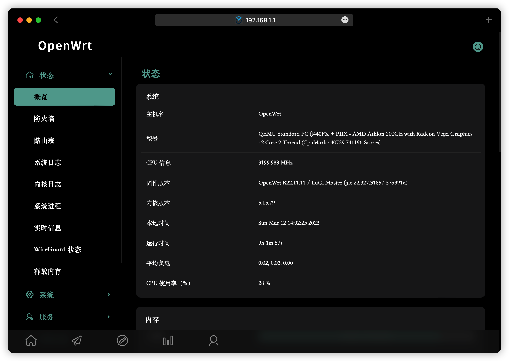
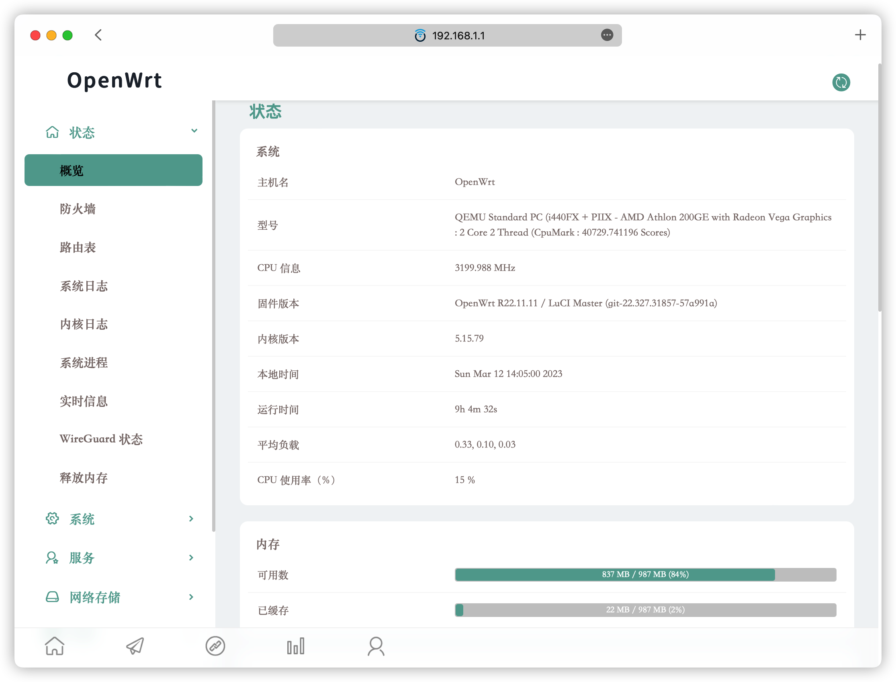
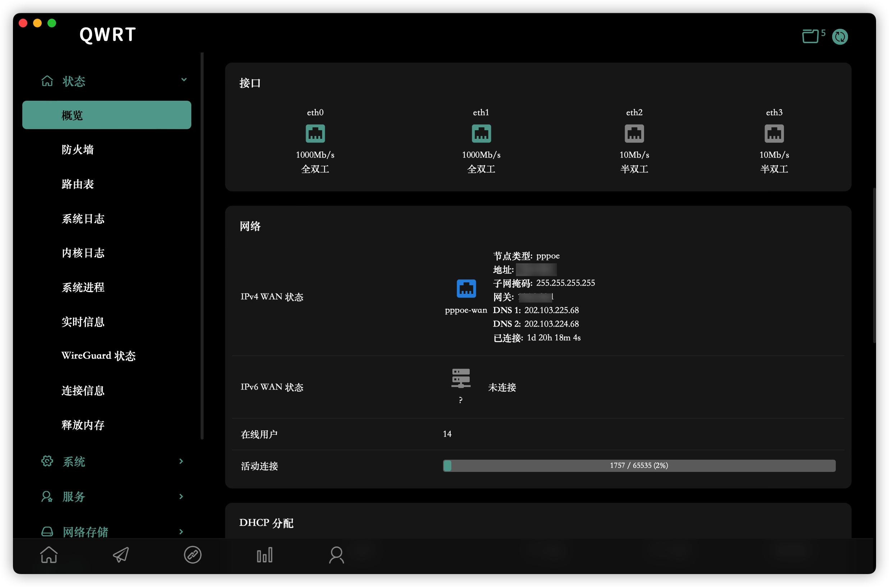

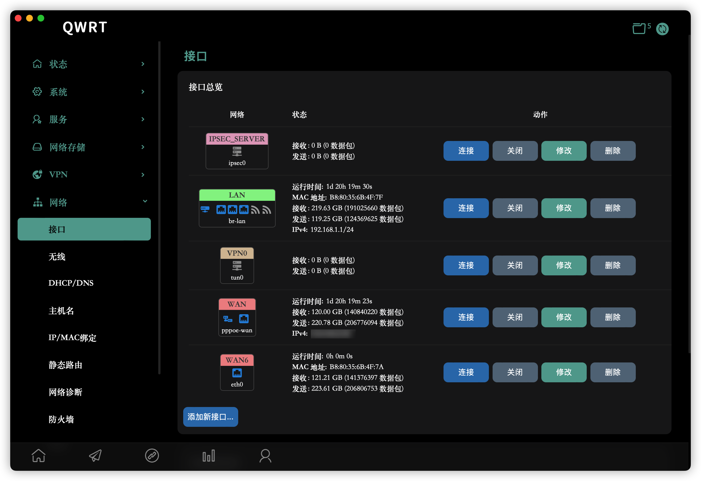
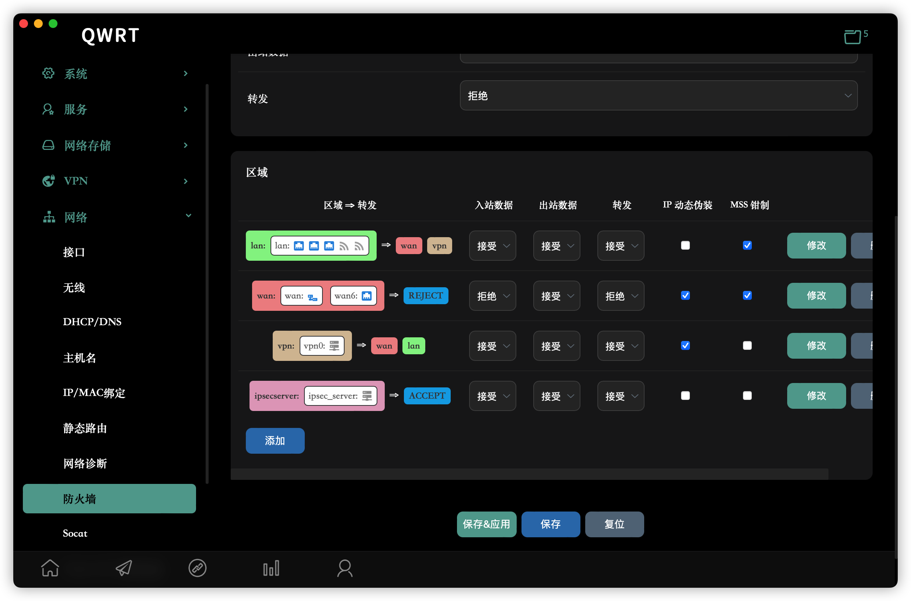
