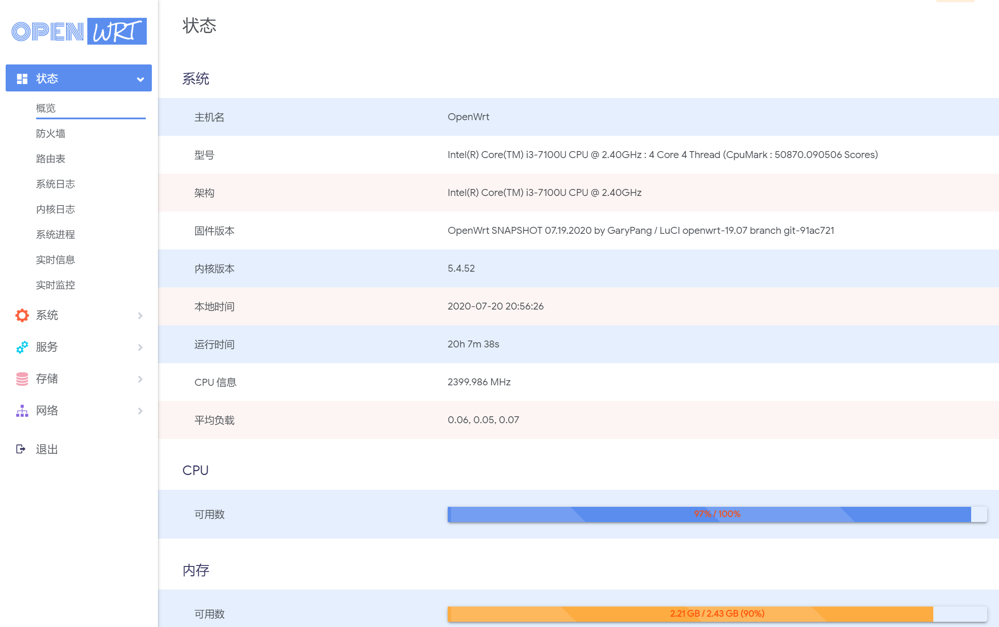
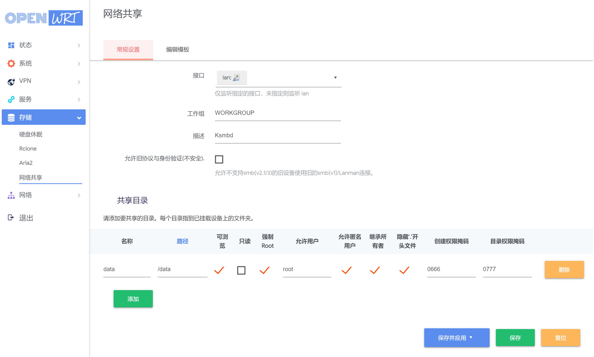
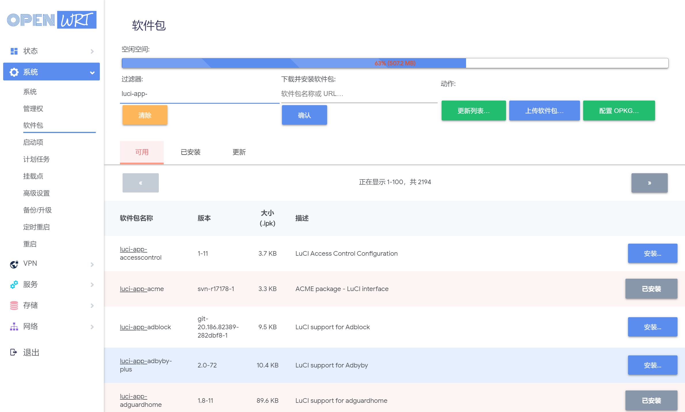
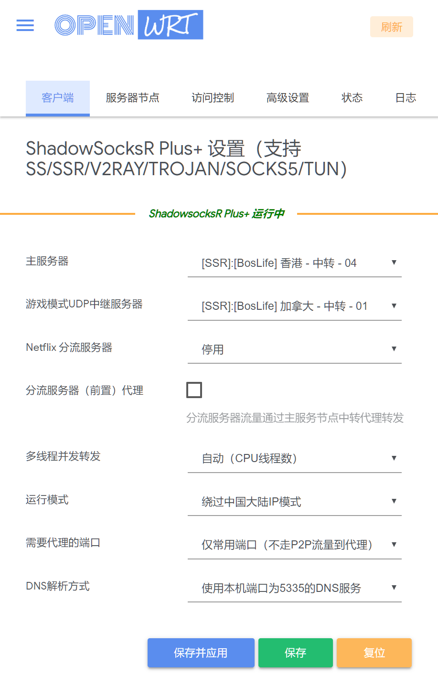

#### luci-theme-edge (/README.md)

#### 屏幕截图
----------------

 
 
 

全新的 Openwrt 主题，基于luci-theme-argon 主题进行修改。 

#### 注意
仅适用于 luci 19.07

#### 感谢
luci-theme-argon: https://github.com/jerrykuku/luci-theme-argon
