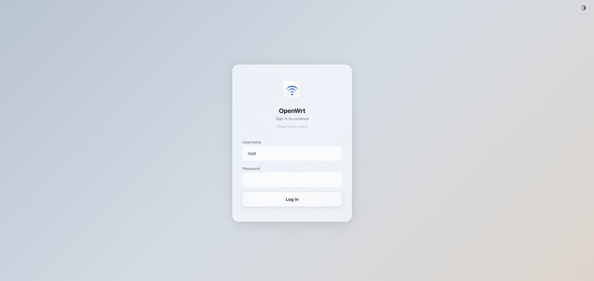
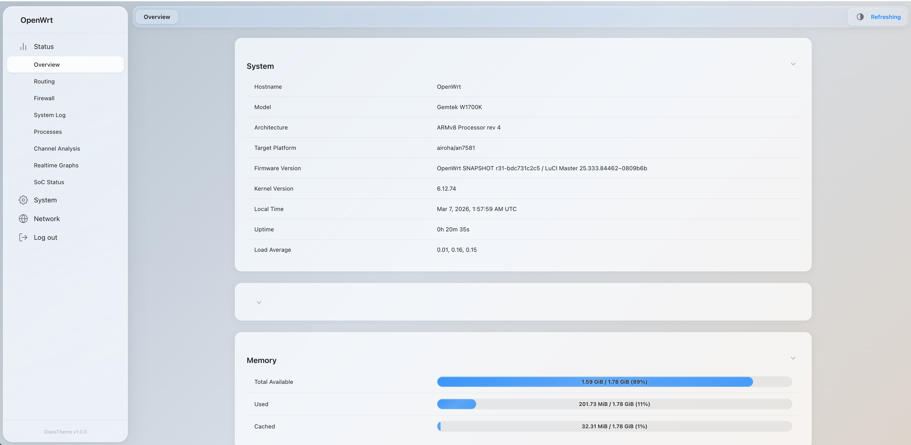
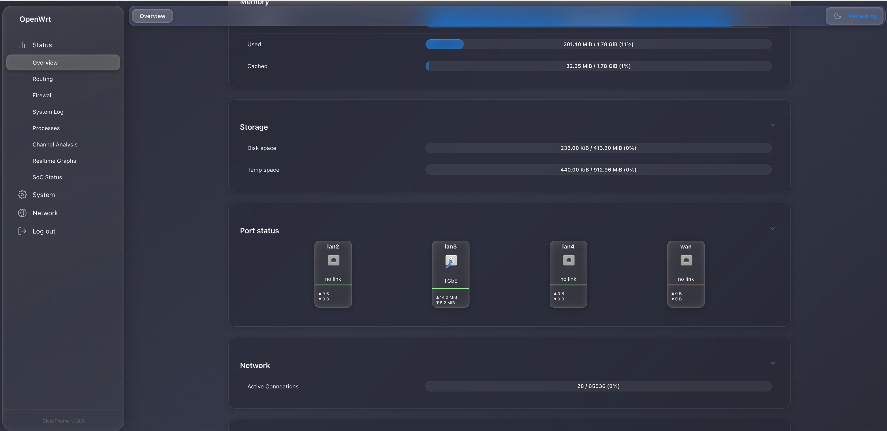
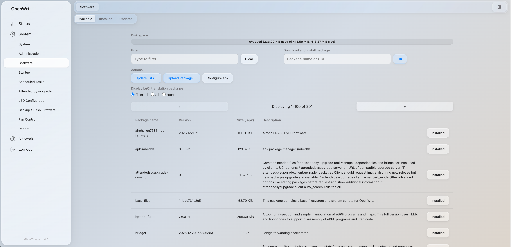
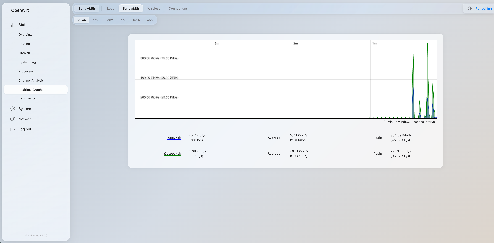

# luci-theme-glass

A glassmorphism theme for OpenWrt LuCI, inspired by Apple's visionOS and macOS. Frosted-glass panels, backdrop blur, translucent buttons, and inset highlights across the entire UI.

**[Live Demo](https://rchen14b.github.io/luci-theme-glass/)** | **[Download](https://github.com/rchen14b/luci-theme-glass/releases/latest)**


[](https://buymeacoffee.com/rchen14b)

## Screenshots

### Login


### Overview (Light)


### Overview (Dark)


### Software


### Traffic Graph


## Features

### Design
- **Glassmorphism everywhere** — `backdrop-filter: blur() saturate()` with multi-stop gradients, translucent backgrounds, 0.5px glass borders, and inset glow highlights on all panels
- **Glass buttons** — Neutral buttons are translucent glass, primary buttons are blue-tinted, danger buttons are red-tinted. No solid-color buttons
- **Frosted sidebar** — Fixed sidebar with 30px blur and inset light diffusion
- **Glass header** — Top nav bar with glass pill badges for page title and status indicators
- **Live status indicators** — CPU load, RAM %, uptime, and WAN throughput in the header bar. Auto-detects WAN interface, resolves bridges, handles DSA hardware offloading. MikroTik-style speed formatting. Color-coded levels and detailed tooltips
- **Glass login card** — Frosted login page with translucent inputs

### Theming
- **Auto / Light / Dark mode** — Toggle in the header bar cycles through Auto (follows OS `prefers-color-scheme`), Light, and Dark. Works on every page including login. Saved to `localStorage` so it persists across sessions
- **Dark mode glass** — Lower-opacity gradients (`rgba(255,255,255,0.05-0.08)`) with adjusted shadows
- **Server-side default** — Set default mode via UCI config (`option mode 'dark'`, `'light'`, or `'normal'` for auto). The client-side toggle overrides this per browser
- **Accent color config** — Primary color, blur radius, and glass transparency are adjustable via UCI
- **Custom wallpapers** — Drop an image or video into the background folder. It shows through all glass panels

### Layout
- **Responsive** — Sidebar collapses to a slide-out drawer on mobile with hamburger toggle
- **Sub-navigation bar** — CBI tab menus get moved into a secondary glass bar below the header
- **Sticky header** — Fixed header with smooth transitions

### Compatibility
- **Full LuCI coverage** — Styles all CBI components: sections, tables, forms, dropdowns, checkboxes, textareas, progress bars, tooltips, modals, tab menus
- **Page-specific fixes** — Overrides inline CSS from LuCI view JS (package manager layout, port status grid, network status cards)
- **OpenWrt 23.05+** — Uses ucode `.ut` templates
- **No dependencies** — Pure CSS, no JS frameworks

## Installation

### From package repository (auto-update, signed)

Add the repository to get updates via the package manager. Both opkg and apk feeds are signed.

**OpenWrt 24.10 and earlier (opkg):**
```sh
# First install: fetch signing public key (one-time)
wget -O /etc/opkg/keys/ef97c468af77cea1 \
  https://raw.githubusercontent.com/rchen14b/luci-theme-glass/main/root/etc/opkg/keys/ef97c468af77cea1

# Add feed and install
echo "src/gz glass https://rchen14b.github.io/luci-theme-glass/packages" >> /etc/opkg/customfeeds.conf
opkg update
opkg install luci-theme-glass
```

**OpenWrt 25.12+ (apk):**
```sh
# First install: fetch signing public key (one-time)
wget -O /etc/apk/keys/glass-apk.rsa.pub \
  https://raw.githubusercontent.com/rchen14b/luci-theme-glass/main/root/etc/apk/keys/glass-apk.rsa.pub

# Add feed and install
echo "https://rchen14b.github.io/luci-theme-glass/apk/packages.adb" > /etc/apk/repositories.d/glass.list
apk update
apk add luci-theme-glass
```

After the first install, the public key persists on the router — future updates via `opkg upgrade` / `apk upgrade` just work. The LuCI web-gui "Update lists" button also works without warnings.

### From release (manual)

Download the latest package from [Releases](../../releases):

- **OpenWrt 25.12+** (apk): `apk add --allow-untrusted luci-theme-glass-*.apk`
- **OpenWrt 24.10 and earlier** (opkg): `opkg install luci-theme-glass_*.ipk`

### From source

```sh
# Add to your OpenWrt build tree
cd /path/to/openwrt
git clone https://github.com/rchen14b/luci-theme-glass.git package/luci-theme-glass

# Build
make package/luci-theme-glass/compile V=s
```

### Manual install (dev)

```sh
# Copy theme files to router
scp -r htdocs/luci-static/glass/ root@router:/www/luci-static/glass/
scp htdocs/luci-static/resources/menu-glass.js root@router:/www/luci-static/resources/
scp -r ucode/template/themes/glass/ root@router:/usr/share/ucode/luci/template/themes/glass/

# Register and activate
ssh root@router "uci set luci.themes.Glass=/luci-static/glass && \
  uci set luci.main.mediaurlbase=/luci-static/glass && \
  uci commit luci"
```

## Configuration

After installation, select **Glass** in **System > System > Language and Style**.

### Theme config

Create `/etc/config/glass` on the router:

```
config global
    option mode 'normal'
    option primary '#007AFF'
    option dark_primary '#0A84FF'
    option blur '20'
    option transparency '0.72'
    option blur_dark '25'
    option transparency_dark '0.30'
```

| Option | Default | Description |
|--------|---------|-------------|
| `mode` | `normal` | `normal` (auto), `dark`, or `light` |
| `primary` | `#007AFF` | Accent color (light mode) |
| `dark_primary` | `#0A84FF` | Accent color (dark mode) |
| `blur` | `20` | Backdrop blur in px (light mode) |
| `transparency` | `0.72` | Glass panel opacity 0-1 (light mode) |
| `blur_dark` | `25` | Backdrop blur in px (dark mode) |
| `transparency_dark` | `0.30` | Glass panel opacity 0-1 (dark mode) |

### Custom wallpapers

Place a file named `bg.*` in `/www/luci-static/glass/background/` on the router.

Supported: `.jpg`, `.jpeg`, `.png`, `.gif`, `.webp`, `.mp4`, `.webm`

The background shows through all glass panels.

## Development

### Prerequisites

- Node.js with `lessc`: `npm install -g less`

### Building CSS

```sh
lessc less/cascade.less htdocs/luci-static/glass/css/cascade.css
lessc less/dark.less htdocs/luci-static/glass/css/dark.css
```

### Project structure

```
luci-theme-glass/
├── Makefile                              # OpenWrt package build
├── htdocs/luci-static/
│   ├── glass/
│   │   ├── css/                          # Compiled CSS
│   │   ├── img/                          # Logo and icons
│   │   └── background/                   # User wallpapers (bg.jpg, etc.)
│   └── resources/
│       ├── menu-glass.js                 # Client-side menu renderer
│       └── status-glass.js               # Header status indicators (CPU, RAM, net, uptime)
├── less/                                 # LESS source
│   ├── cascade.less                      # Master import file
│   ├── variables.less                    # Design tokens (CSS custom properties)
│   ├── normalize.less                    # CSS reset
│   ├── glass.less                        # Glassmorphism mixins
│   ├── layout.less                       # Sidebar, header, footer, content
│   ├── components.less                   # CBI forms, tables, buttons, alerts
│   ├── sysauth.less                      # Login page
│   ├── page-fix.less                     # LuCI page-specific overrides
│   ├── dark.less                         # Dark mode overrides
│   └── responsive.less                   # Mobile breakpoints
├── ucode/template/themes/glass/          # Server-side ucode templates
│   ├── header.ut                         # HTML head + sidebar + header
│   ├── header_login.ut                   # Login page variant
│   ├── footer.ut                         # Footer + scripts
│   ├── footer_login.ut                   # Login footer variant
│   └── sysauth.ut                        # Login page
├── root/                                 # Files installed to device root
│   ├── etc/uci-defaults/                 # First-boot theme registration
│   └── usr/share/rpcd/acl.d/            # ACL permissions
└── screenshots/
```

### Design system

Design tokens live in `variables.less`. Glass effects use three LESS mixins:

| Mixin | Use | Blur | Opacity |
|-------|-----|------|---------|
| `.glass-effect()` | Panels, cards | `var(--glass-blur)` | `var(--glass-bg)` |
| `.glass-frosted()` | Sidebar, login card | 30px | Higher |
| `.glass-subtle()` | Secondary elements | Lower | Minimal |

### Version bump checklist

1. `Makefile` — `PKG_VERSION`
2. `README.md` — version badge
3. `ucode/template/themes/glass/sysauth.ut` — login version text
4. `ucode/template/themes/glass/header.ut` — sidebar version text
5. `ucode/template/themes/glass/footer.ut` — footer version text

## Credits

- Architecture based on [luci-theme-argon](https://github.com/jerrykuku/luci-theme-argon)
- Glass effects from [glass-ui](https://github.com/crenspire/glass-ui)
- Design language from Apple visionOS / macOS

## License

Dual-licensed:

- **Open Source**: [GPL-3.0](LICENSE) — free for personal, educational, and open-source use. Derivatives must also be GPL-3.0.
- **Commercial**: Proprietary/closed-source use requires a separate license. Contact the author.
