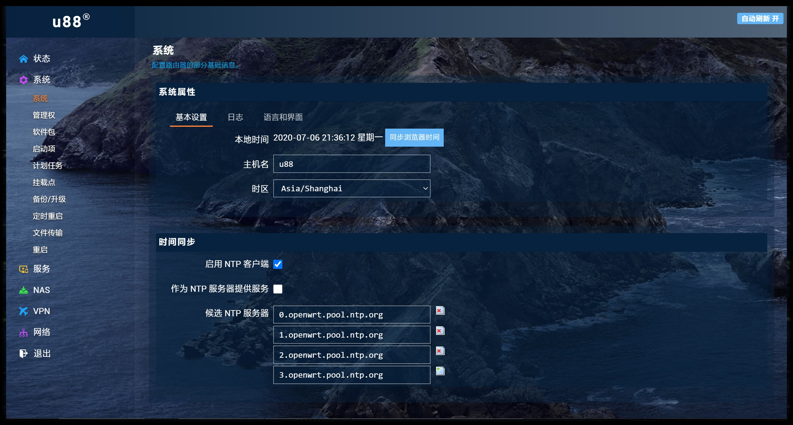
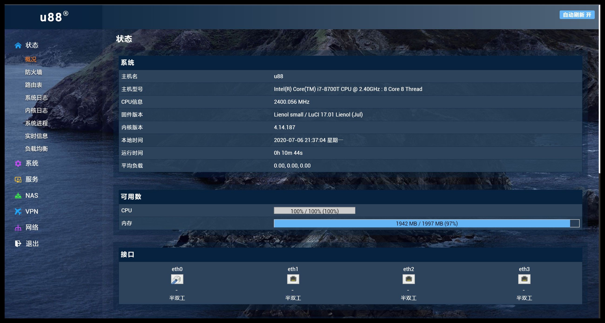
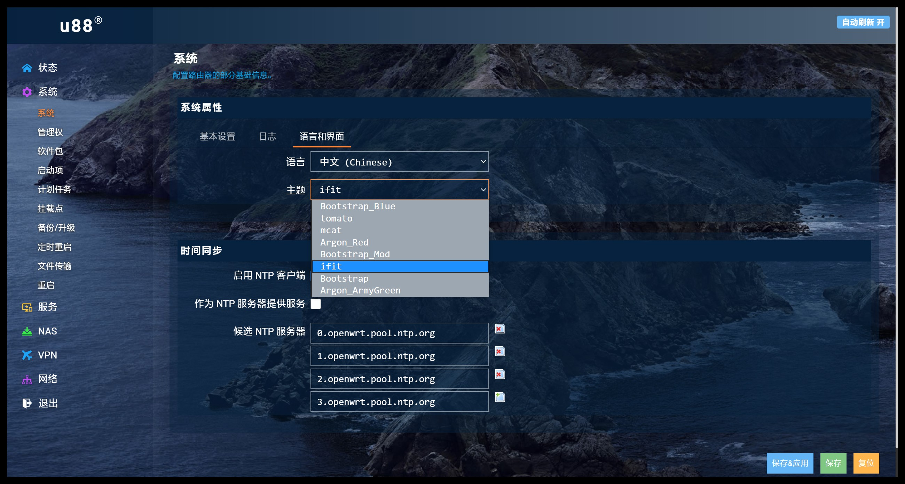
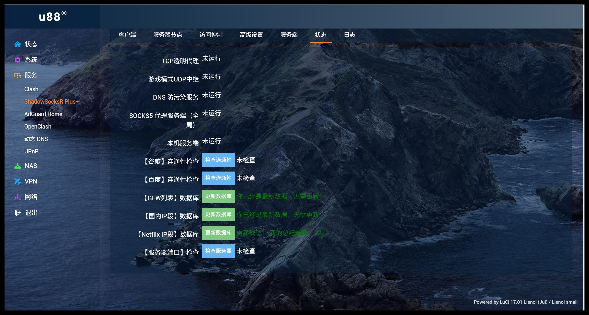
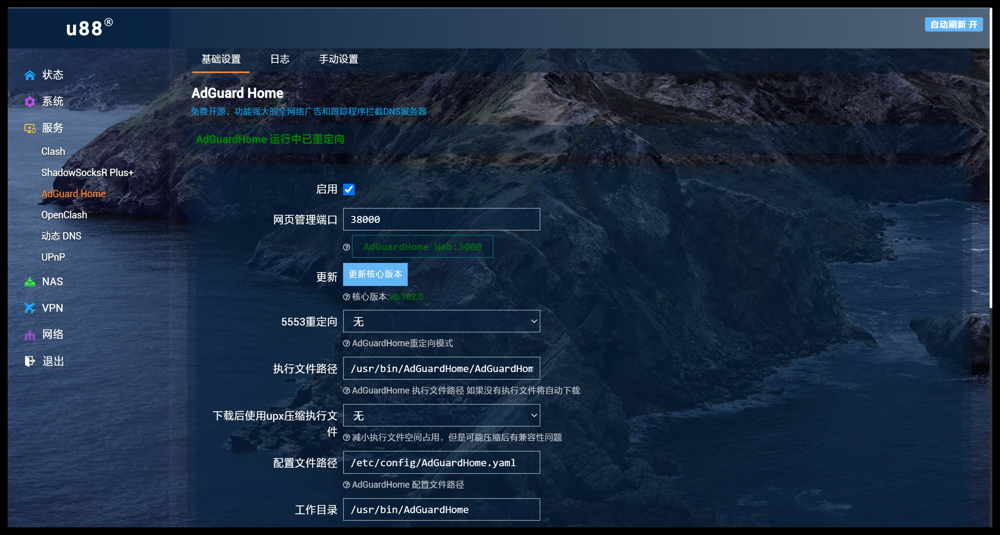

# luci-theme-ifit

原作者 https://github.com/xiaoqingfengATGH/luci-theme-infinityfreedom

觉得名字太长，修改了下，并修复了不能修改主机名的错误！

ifit 是一款基于luci-theme-material构建的，使用HTML5、CSS3编写的Luci主题。

这个主题是为HomeLede（基于OpenWrt，专门为家庭使用场景设计的固件）专门设计的，也可以用于OpenWrt其他版本，目前兼容Luci18，Luci其他版本计划在此版本稳定后开发。

### 将 ifit 主题添加至 LEDE/OpenWRT 源码的方法。

编辑源码文件夹根目录feeds.conf.default并加入如下内容:

    # luci-theme-ifit
    src-git ifit https://github.com/kenzok8/luci-theme-ifit.git

更新feeds，并安装主题：

    $ scripts/feeds update ifit
    $ scripts/feeds install luci-theme-ifit

打开配置菜单：

    $ make menuconfig

找到 LuCI -> Themes, 选择 luci-theme-ifit, 保存后退出，编译固件。 

主题默认会自动启用，如果没有启动可以手动开启。

手动开启主题
----------------

  * 系统 -> 系统 -> 语言和界面
  * 主题处选择 'ifit'，右下角“保存&应用”
  * 按F5刷新浏览器

屏幕截图
----------------

