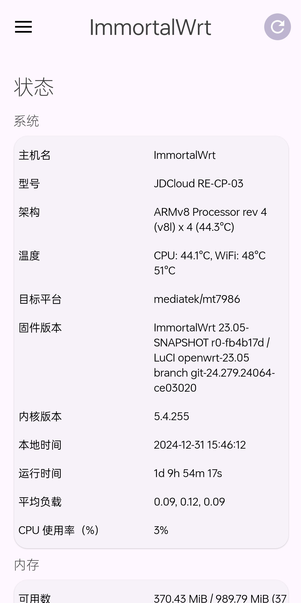
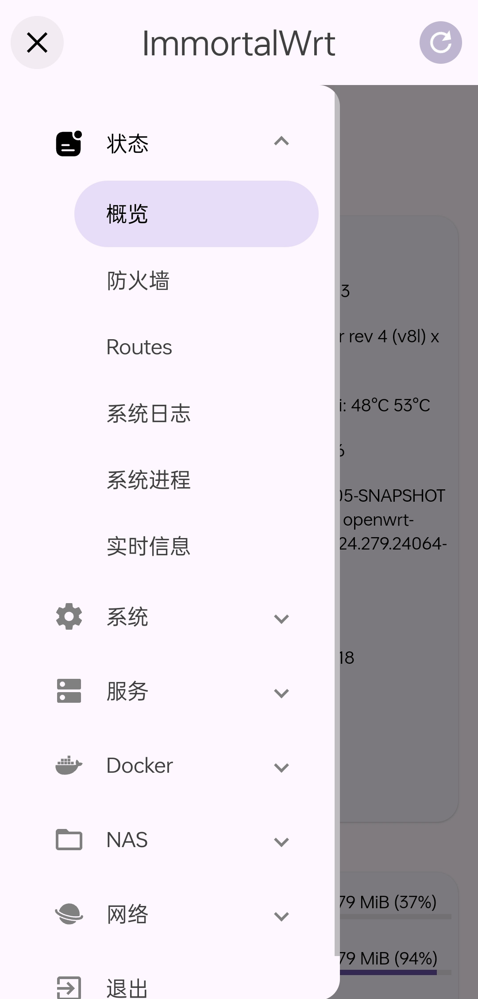
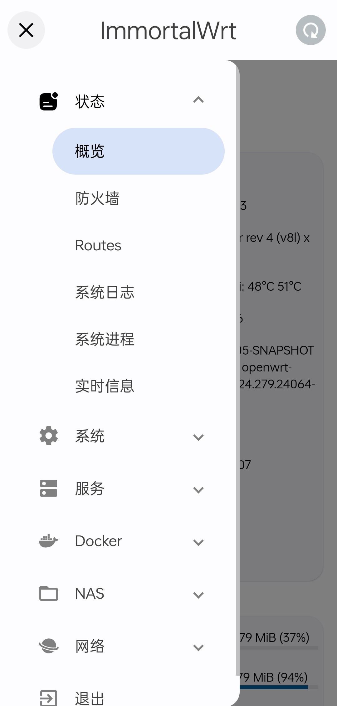
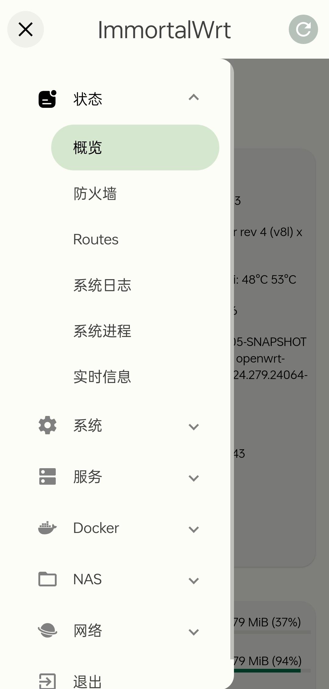
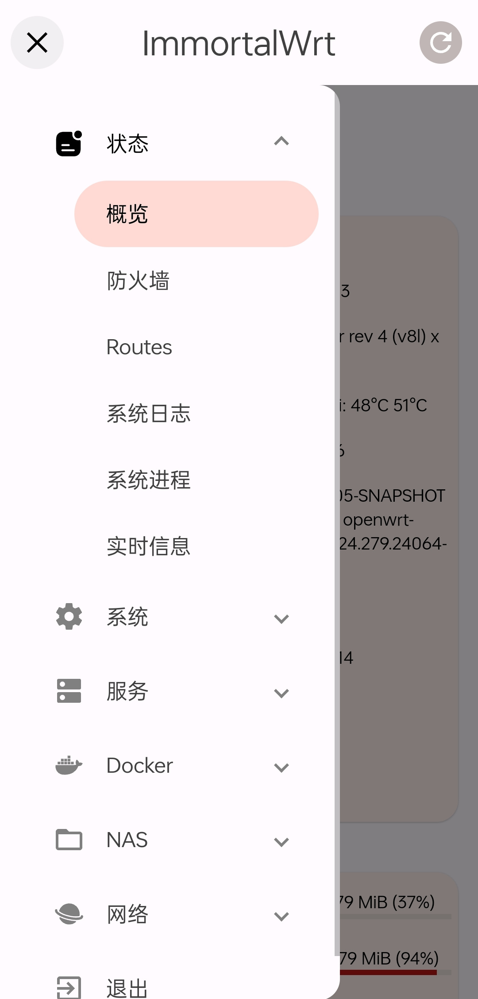

# luci-theme-material3
A Material Design 3 theme for OpenWrt Luci.

This is a personal project based on the LuCI Bootstrap theme, imitating the Material Design 3 style. Since I'm not very familiar with web theme design, the CSS code might be a bit messy. Some of the project code was completed with the assistance of Cursor AI.

**Nice to initiate an issue or PR!**
## ✨ Preview
<table>
  <tr>
    <th>🖥️ Desktop</th>
    <th>📱 Mobile</th>
  </tr>
  <tr>
    <td></td>
    <td></td>
  </tr>
</table>

### 🎨 All color schemes
<table>
  <tr>
    <td></td>
    <td></td>
    <td></td>
    <td></td>
  </tr>
</table>

## 📝 ToDo
- [X] Dark themes
- [ ] Fix some style issues
- [ ] Add more color schemes
- [ ] Improve to be closer to MD3 principles
- [ ] Optimize CSS...

## 🙏 Credits
- [OpenWrt Luci](https://github.com/openwrt/luci)
- [Cursor](https://www.cursor.com/)
- [MDUI](https://www.mdui.org/zh-cn/)
- [Material Design 3](https://m3.material.io/)
- [Reddit - LuCI theme bootstrap: Some modifications using userstyle](https://www.reddit.com/r/openwrt/comments/qmtmpf/lucithemebootstrap_some_modifications_using/)
