# luci-theme-material3
A Material Design 3 theme for OpenWrt Luci.

This is a personal project based on the LuCI Bootstrap theme, imitating the Material Design 3 style.

**Nice to initiate an issue or PR, and star! ⭐**

## ✨ Preview
<table>
  <tr>
    <th>🖥️ Desktop</th>
    <th>📱 Mobile</th>
  </tr>
  <tr>
    <td>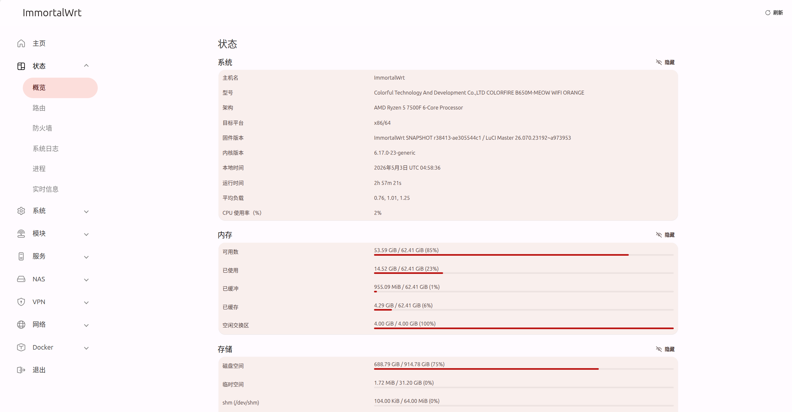</td>
    <td>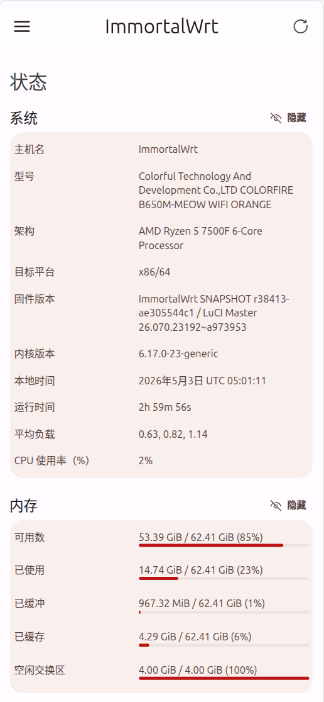</td>
  </tr>
</table>

### 🎨 All color schemes
<table>
  <tr>
    <th width="33.33%" align="center">Baseline Purple</th>
    <th width="33.33%" align="center">Trust Blue</th>
    <th width="33.33%" align="center">Growth Green</th>
  </tr>
  <tr>
    <td width="33.33%" align="center">
      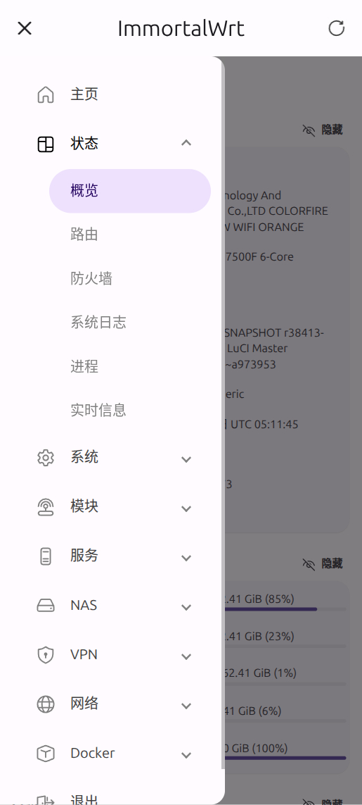
    </td>
    <td width="33.33%" align="center">
      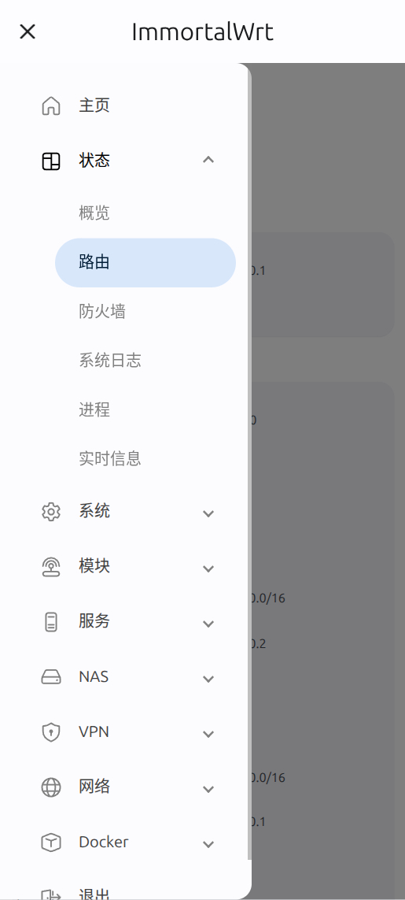
    </td>
    <td width="33.33%" align="center">
      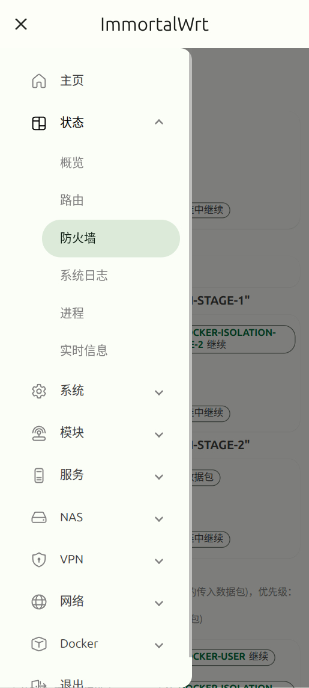
    </td>
  </tr>
  <tr>
    <th width="33.33%" align="center">Calm Teal</th>
    <th width="33.33%" align="center">Warm Orange</th>
    <th width="33.33%" align="center">Vivid Orange</th>
  </tr>
  <tr>
    <td width="33.33%" align="center">
      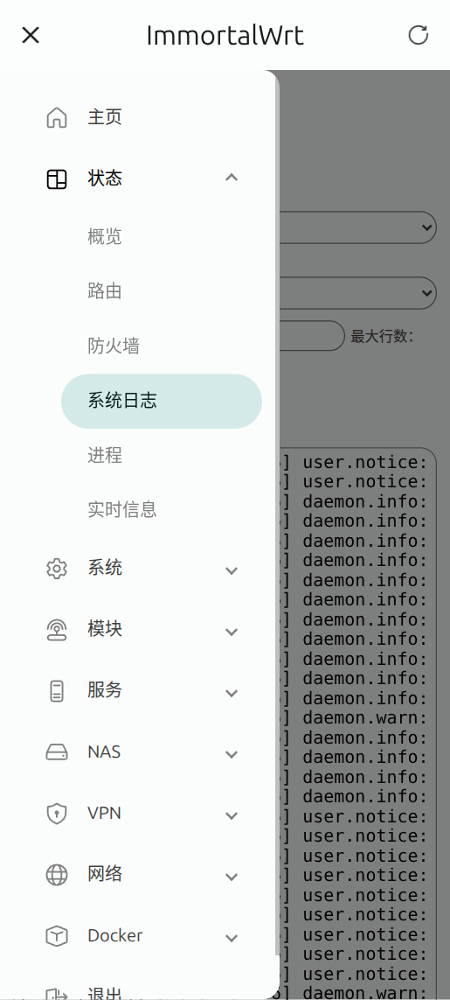
    </td>
    <td width="33.33%" align="center">
      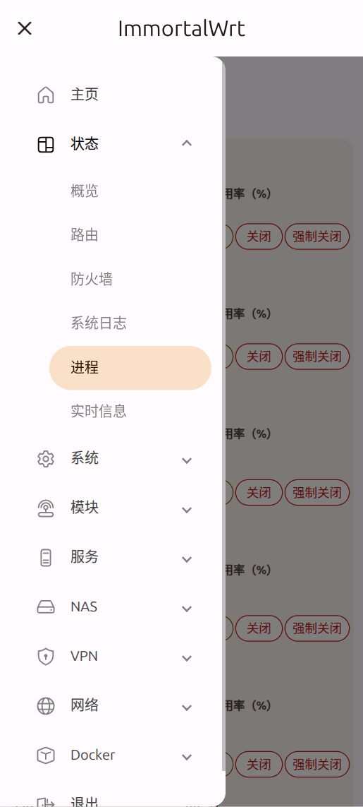
    </td>
    <td width="33.33%" align="center">
      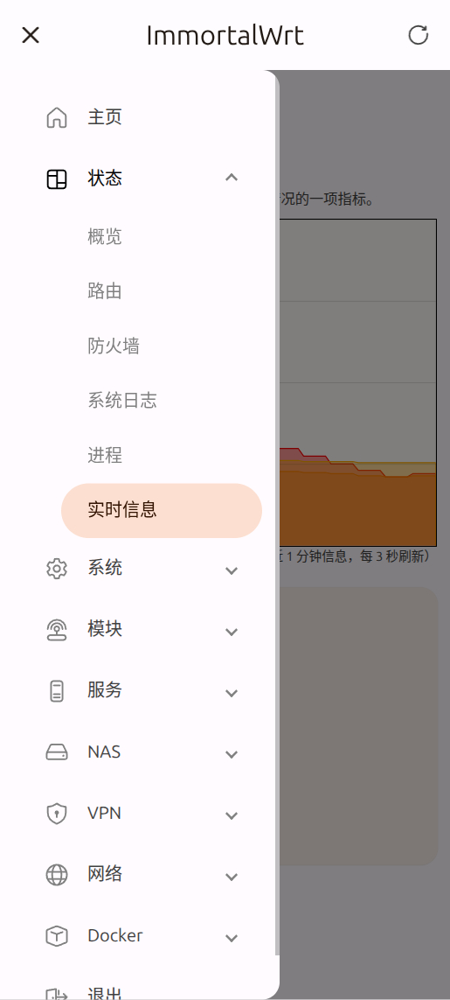
    </td>
  </tr>
  <tr>
    <th width="33.33%" align="center">Sakura Red</th>
    <th width="33.33%" align="center">Expressive Rose</th>
    <th width="33.33%" align="center">Monochrome Gray</th>
  </tr>
  <tr>
    <td width="33.33%" align="center">
      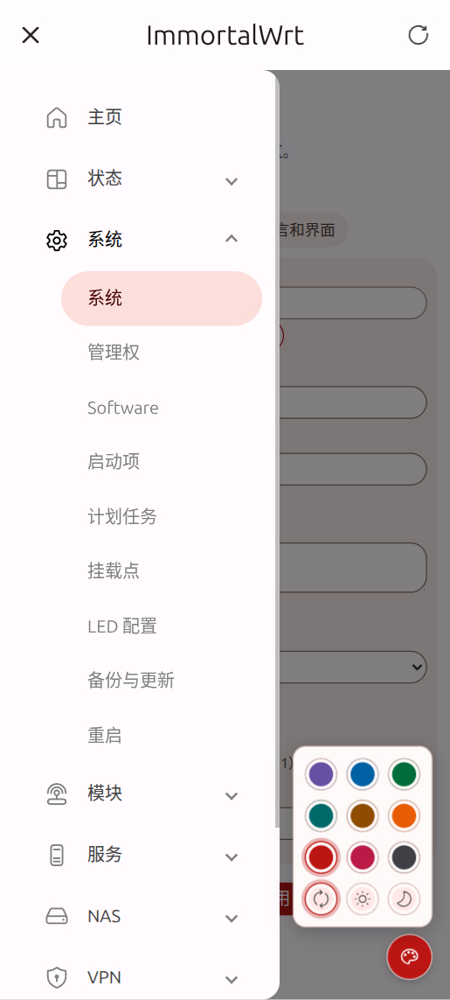
    </td>
    <td width="33.33%" align="center">
      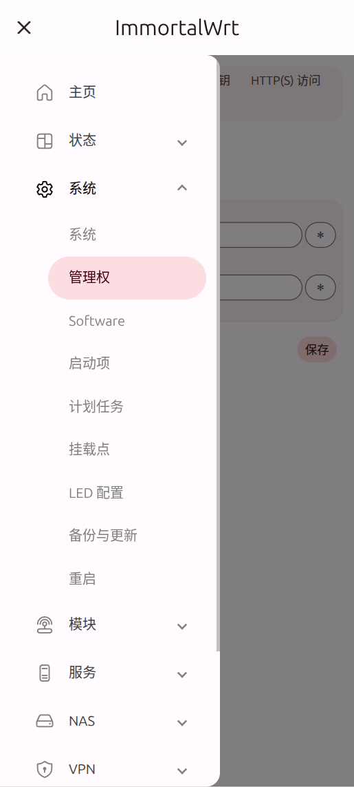
    </td>
    <td width="33.33%" align="center">
      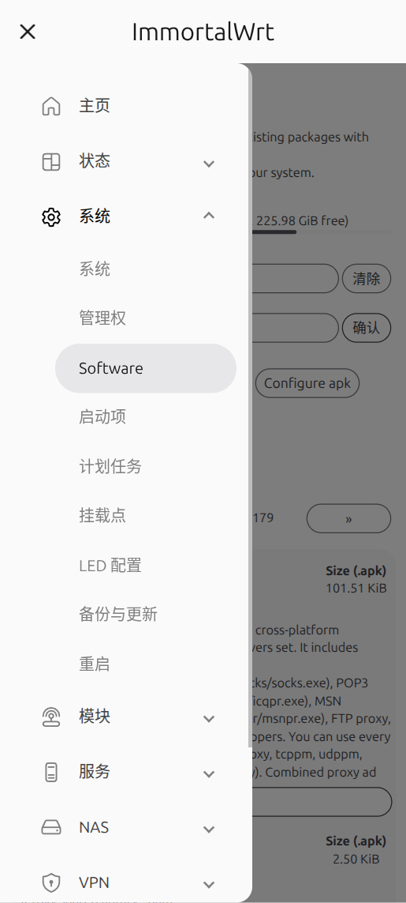
    </td>
  </tr>
</table>

## 📦 Release
Download prebuilt packages from [GitHub Releases](https://github.com/KawaiiHachimi/luci-theme-material3/releases).

- `luci-theme-material3-*.apk` -> OpenWrt LuCI 25.12+
- `luci-theme-material3_*.ipk` -> OpenWrt LuCI 23.05~24.10

## 🙏 Credits
- [OpenWrt Luci](https://github.com/openwrt/luci)
- [Cursor](https://www.cursor.com/)
- [OpenAI Codex](https://openai.com/codex/)
- [MDUI](https://www.mdui.org/zh-cn/)
- [Fluent UI System Icons](https://github.com/microsoft/fluentui-system-icons)
- [Material Design 3](https://m3.material.io/)
- [Reddit - LuCI theme bootstrap: Some modifications using userstyle](https://www.reddit.com/r/openwrt/comments/qmtmpf/lucithemebootstrap_some_modifications_using/)
